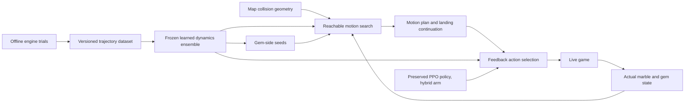

# Learned physics and route discovery: kotmjump implementation plan

Date: 2026-09-27. Status: **the plan we follow** (operator, 2026-09-27); implementation has not started.
The next session starts with [KOTMJUMP_START_HERE.md](KOTMJUMP_START_HERE.md): the first experiment, P0.
The operator's answers of 2026-09-27 (drill map, approval scope, training stopped, P0 pass margin, fixed
reference maps Horizon and Archipelago) are recorded on that page and in sections 4.1 and 10.
Revised 2026-09-27: physical coverage comes from **the game's own maps** (D4 and section 4.1; a purpose-built
lab map was considered and dropped by the operator the same day). Six revisions from a review were agreed the
same day, followed by the interface and evaluation refinements in section 1.1. All are folded into the text.

The first deliverable is a navigator that can build a run-up, collect a floating gem in flight,
land safely, and continue playing on `kotmjump`. The next deliverable is discovery of useful routes:
choosing approaches, takeoff locations, air inputs, landings, and gem order that reduce actual completion
time. These choices must come from geometry, measured dynamics, and search, without map-specific rules.

Read this document with [BIG_QUESTIONS.md](BIG_QUESTIONS.md) and
[HANDOFF_NAV_TRAINING.md](HANDOFF_NAV_TRAINING.md). The former records the architectural questions;
the latter remains authoritative about the deployed agent. [PHYSICS_PLANNER_PLAN.md](PHYSICS_PLANNER_PLAN.md)
is the earlier jump-predictor proposal. This document is authoritative for the agreed experimental
architecture where those earlier proposals differ. It does not claim that the experiment is built,
that its performance targets have been met, or that the deployed defaults have changed.

Start the implementation with the P0 prototype ([KOTMJUMP_START_HERE.md](KOTMJUMP_START_HERE.md), and
P0a/P0b in section 10): a small recorded flight experiment on one kotmjump hole, then learned action selection
on held-out starts. This document is the reference specification for everything after it. The build order is:
small recorded flight experiment, learned action selection on held-out starts, trustworthy general data
pipeline, reachable approaches and route comparisons, hybrid handovers and full rounds.

## 1. Outcome, scope, and design choices

Success means **pickup plus a useful continuation**, not merely pressing jump or touching a floor.

The initial experiment uses one game instance, static geometry, ordinary movement and jumping, and no
opponents. Powerup activation and blast are excluded from the action space. The mission itself need not
be changed. Record any automatically activated effect, changed radius, or changed dynamics; such states
must be represented or excluded explicitly from the initial physics dataset. Collecting an inventory
item must not silently change the assumed dynamics.

The architecture has three parts:

1. A dynamics model learned offline from actual engine trajectories: a step model for every 64 ms, plus a
   direct flight head that predicts a whole jump in one pass.
2. Sparse search over reachable motion states from the actual state, with transitions generated by the
   learned model and guided by gem-side seeds (states whose predicted flight reaches the target).
3. A feedback controller that executes the first action of a selected sequence, observes the result,
   and updates the remaining sequence. In a second arm, the preserved PPO policy drives between planned
   manoeuvres and the controller takes over only for them.

During a scored round, hypothetical trajectories use the learned model only. There are no engine
rollouts, teleports, state restores, forced gem spawns, or privileged respawns during play.



### Decisions for this experimental implementation

| Question | Design choice |
|---|---|
| D1: air input | Condition on sequences of inputs, including switches during flight. Constant holds are initial data, not a permanent action restriction. |
| D2: after landing | Record and model a continuation from the start, including the actual inputs used during it. |
| D3: separate model | A separate ensemble, frozen during each evaluation. No joint PPO/dynamics training initially. |
| D4: maps | Use verified game maps, starting with KOTM/kotmjump. Track joint geometry, motion and control coverage. Keep fixed reference map families out of training alongside rotating unseen-map transfer tests (section 4.1). |
| D5: spin | Use the existing spin observation and extend the experimental state with actual contact information. |
| D6: old jump rules | Keep the baseline intact. The new planner's decisions must not depend on `MIN_JUMP_GAP`, fixed cruise-speed jump edges, or the binding jump prior. |
| Geometry | Staged: height crops plus surface normals and materials from the map's collision surfaces, plus exact edge features computed from the mesh (lip distance, lip height, gap width), first; a triangle-level encoder only when errors at lips or walls show this is the limit (section 3). |
| Jump evaluation | A direct flight head starts at the jump-command state and predicts a timed trajectory sufficient to assess pickup, takeoff/collision events, landing and an action-conditioned continuation. Engine-calibrated reliability governs its use; step-model disagreement is a diagnostic (section 5). |
| Search direction | Generate transitions forward from the actual state, seeded with gem-side states whose predicted flight reaches the target. Propagate costs backward over discovered directed connections when useful (section 6). |
| Plan representation | Internal trajectories and state regions, including velocity and spin; gems remain the actual objectives. |
| Final control | Two arms: the predictive controller selects every action, or PPO drives between controlled manoeuvres. Hybrid takeover covers necessary objectives and worthwhile shortcuts; handback requires a tested exit state, not floor contact alone. PPO alone is the baseline (section 7). |
| Latency | Measured and logged from the start; a pass/fail gate only at M5 (section 7). |
| Policy training | Defer policy distillation and further PPO changes until the planner/controller has demonstrated useful behavior. |

### 1.1 Revisions agreed in review (2026-09-27)

A review of this design proposed six revisions; the operator agreed to all of them the same day. They are
written into the sections named here.

1. **Staged geometry** (section 3): height crops plus surface normals from the map file first; the triangle
   encoder only when errors at lips show the height representation is the limit.
2. **A flight head is core** (section 5): a direct "jump now with this air-input sequence" prediction beside
   the step model, to reduce reliance on recursively predicted flights where errors can accumulate.
3. **Gem-side seeding** (section 6): launch states whose predicted flight passes through the target, or lands
   where the remaining trip makes the whole route faster (a shortcut across a hole to a floor gem), guide the
   forward search, which otherwise often exhausts its budget before finding the jump.
4. **Latency gated only at M5** (sections 7 and 10): under lockstep, slow planning costs throughput, not
   correctness.
5. **A PPO-plus-planner arm** (sections 7 and 10): the preserved PPO policy drives and the controller takes over
   for planned manoeuvres.
6. **Fewer modules at first** (section 9): five instead of thirteen.

The operator also approved these follow-up refinements on 2026-09-27:

* **Complete flight contract** (section 5): predict pickup-relevant motion from the jump-command state,
  including delayed/failed takeoff, explicit continuation inputs and airborne replanning semantics.
* **Explicit hybrid handovers** (section 7): take control early enough for the approach, cover required
  objectives as well as time-saving shortcuts, and return control only from a tested continuation state.
* **Reachable launch regions** (section 6): preserve coupled speed/heading/spin constraints and re-evaluate
  the flight from the actual predicted endpoint of the approach; an approximate seed match is not enough.
* **Engine-calibrated predictor selection** (section 5): disagreement schedules offline trials; agreement
  alone proves nothing, and a drifting long step rollout must not veto a separately validated flight head.
* **Geometry and evaluation evidence** (sections 3, 4 and 10): test edge-resolution limits explicitly,
  measure joint terrain/motion/control coverage, and retain a fixed benchmark alongside rotating maps.
* **Implementation sequence** (sections 8, 10 and 11): first prove a complete floating-gem manoeuvre from
  varied approaches, then compare executable routes and integrate the hybrid arm for full-round tests.

Final refinements, agreed 2026-09-27, after which this document became the plan we follow:

* **Prototype first** (sections 8, 10, 11 and the start page): a small recorded flight experiment on one
  kotmjump hole, then learned action selection on held-out starting states, compared with a fixed manoeuvre,
  random choices and the existing hand-written predictor over the same candidates, with an offline oracle
  showing which starts are feasible. It needs trustworthy recordings, not the full infrastructure. The
  controller is expendable; the recordings are kept.
* **Engine changes are conditional:** investigate the existing collision/contact information first; add a
  C++ accessor only if it proves insufficient. The prototype does not wait for general contact telemetry.
* **Handback, staged** (section 7): a candidate rule from PPO's own traces including local clearance, then a
  small batch of real handovers, then drills only where failures justify them; after the first learned jump.
* **One or two fixed reference families** (section 4.1), not a large held-out share of the catalog.
* **A short start page** ([KOTMJUMP_START_HERE.md](KOTMJUMP_START_HERE.md)); this document is the reference.

A third, outside review (2026-09-27) led to four further additions, agreed by the operator:

* **Exact edge features from the collision mesh in Stage 1** (section 3): lip distance along the motion, lip
  height and gap width at full precision, instead of reading them off the 0.5 u grid.
* **Approach candidates aimed at seed regions** (section 6): proposals that drive toward a seed's launch
  region at its speed and heading, beside the broad random proposals.
* **Kept-versus-reset memory at handback** (section 7): the handover batch compares PPO's recurrent state kept
  current during takeover with a reset at handback.
* **A time-to-gem guide learned from PPO's play** (section 6, from M3): a search heuristic for ordinary rolling
  costs, never a verdict on jump routes.

The review's other proposals were not adopted: building the triangle encoder before the first experiment
(the edge features cover most of the need, and P0 tests the grid directly), and PPO proposing targets while
the controller does all driving (PPO's proven strength is driving; controller driving on ordinary floor is
unproven, and the two execution arms answer this empirically).

The internal motion targets and final-action selection are explicit departures from the old
gems-only-waypoint and policy-only-execution designs. This is the agreed experimental architecture,
not a change to those deployed defaults. Visible in-game markers continue to identify real gems;
intermediate trajectories belong in diagnostic plots. This documentation task does not start runtime
implementation or a training run.

## 2. Starting point and the exact map task

### Baseline to preserve

As inspected on 2026-09-27:

- `models/nav/nav_latest.pth` matches `models/nav/nav_v6_start_26110.pth` byte for byte.
- This is the best preserved 26113 policy migrated to NAV_OBS_V6: 154.0 KOTM points and 1.625 falls per
  round in the saved eight-round deterministic 3x evaluation.
- The later V6 endpoint scores 150.0. Adding spin did not establish a gain.
- Existing training uses seven KOTM instances and one FlatIslands instance. `kotmjump` is not in that pool.
- Existing control uses 64 ms decisions under fixed step and lockstep, with a camera-aware joystick
  mapping. Changing frame subdivision has previously changed effective control behavior.

Keep the named baseline immutable. Write new model artifacts under a separate directory. Do not copy
an experimental checkpoint over `nav_latest.pth` as part of data collection or evaluation.

### kotmjump facts, verified from the mission file

Mission: `../Marble Blast Platinum/platinum/data/multiplayer/hunt/custom/kotmjump.mcs`.
It references `KingOfTheMarble.dif`, runs a 180,000 ms Hunt round, and defines four gem groups, each
containing three floor gems and one floating gem. There are 16 gem locations in total.

The four floating locations are listed here solely to identify evaluation cases:

| Group, in mission order | Floating gem world position |
|---|---|
| 1 | `(-30.25, 10.05, 21.7)` |
| 2 | `(-20.25, 10.05, 21.7)` |
| 3 | `(-20.25, 20.05, 21.7)` |
| 4 | `(-30.25, 20.05, 21.7)` |

Parse objectives and group membership from the mission/live game. Do not embed these coordinates,
group numbers, prescribed approaches, or hole widths in navigation code. At runtime, consume the
currently active gems rather than assuming all 16 are present or knowing future spawn choices.

Existing terrain files include `terrain_maps/terrain_kotmjump.npz` and
`terrain_maps/terrain_fine_kotmjump.npz`. Their existence is not proof of collision accuracy.

Three details make this a useful test:

1. A floating gem is an **in-flight pickup volume**, not a landing destination. Never snap it to floor.
2. A failed pickup can leave the current group blocked even after an otherwise successful landing.
3. Collecting the final gem can spawn a new group while the marble is still airborne. Finish or safely
   revise the active landing plan; do not discard it just because the gem target changed.

KOTM and kotmjump share geometry. Testing between them measures task transfer, not unseen-map transfer.

## 3. Repair the information contract before learning dynamics

### State and action schema

Use a versioned experimental protocol/metadata extension. Preserve the baseline's 38-number observation
contract; do not shift its indices or silently fill absent contact telemetry with zero. Require a
capability handshake for the experimental runner and fail visibly when required fields are missing.

| Record | Required contents |
|---|---|
| Physical state | Tick/time, position, linear velocity, angular velocity, actual radius, gravity/rules configuration, game mode, active effects/timers that influence dynamics. |
| Contact state | Current contact flag, contact normals/points and material properties, with a timestamp. Preserve multiple contacts near a floor/wall/edge where relevant. |
| Applied action | World direction, throttle, jump state, brake state, powerup activation disabled, duration in ticks; also log the actual serialized controls and camera yaw. |
| Game objective | Active gem identities/positions/values, pickup events, score delta, OOB state, remaining round time, group/spawn generation. |
| Provenance | Engine/build hash, script hashes, mission/geometry hashes, protocol/schema version, frame and action timing, action-mapping version, seed, trial and parent trajectory IDs. |

The engine already supports spin in `TELEPORT x y z vx vy vz wx wy wz`. However,
`nav/protocol.py:format_teleport` and `nav/env.py:HuntEnv.teleport` currently expose only position and
velocity. Extend the experimental API or use an explicit command that includes spin. Do not assume
`env.teleport(...)` sets it correctly today.

The current `nav/obs.py` floor test requires `abs(vz) < 0.3`; this misclassifies ordinary uphill rolling.
Use actual engine contact telemetry for the new model and its labels. Investigate the engine's
`onCollide` information, but verify its freshness and whether it covers the desired authoritative state.
A remembered callback normal is not proof of current contact. Clear contact state per physics frame,
including frames with no contact; if needed expose a small C++ telemetry accessor.

The engine worktree is currently `C:/Users/doug/src/OpenPQ-TGEMIT-mbx`, with the relevant simulation in
`engine/game/marble/marble.cc`. Confirm the authoritative marble object and build before instrumenting.
Audit history-dependent fields such as mode, contact timing and pending inputs. Repeated teleports
giving repeated trajectories do not alone prove equivalence to naturally reached rolling states.

For initial actions, retain the existing legal joystick adapter and 64 ms action interval. The new
controller can choose throttle throughout `[0, 1]`; the old policy's 0.90 floor is not a physical limit.
No input is a real action with braking effects, not an assumption of coasting. Recompile each candidate
action with the same adapter at each predicted state when its meaning depends on velocity, as braking does.

### Geometry contract

Build a separate geometry artifact from transformed collision surfaces. Retain all face orientations,
normals, surface/material identity, friction/restitution mapping, bounds, and source hashes. Validate
which DIF detail/hull surfaces actually collide; the existing visualization extractor is a starting
point, not an authoritative collision exporter. Account for other collidable mission objects or mark
them unsupported explicitly. Do not silently treat unexported geometry as empty space.

Stage the geometry representation.

* **Stage 1, the pilot:** the existing coarse and fine height rasters, plus surface normals and material
  identity taken from the exported collision surfaces and sampled at the same cells and height layers.
  This is a hypothesis of sufficient resolution for kotmjump/KOTM, not a guarantee from their 2.5-D layout.
  Normals remove the slope-by-differencing error; they do not reconstruct missing walls, bevels or sub-cell
  lips. So Stage 1 also computes a few **exact edge features from the collision mesh**, not from the grid:
  distance to the lip along the motion and to either side, the lip's height and shape (square or bevelled),
  and the gap width and landing height beyond it. They are cheap ray/segment queries against the exported
  surfaces and carry sub-cell precision exactly where it matters. Freeze crop extents/resolutions in the
  manifest and test edge contacts at varied sub-cell offsets, speeds and approach angles before accepting the
  representation.
* **Stage 2, when the evidence asks for it:** local collision geometry queries that preserve lips and walls
  exactly. Move to this stage when prediction errors at lips or walls, reported per situation label, show
  the height representation is the limit, or when a map with overhangs or tunnels enters the data. A
  practical encoder is a small shared MLP over nearby triangle features (relative vertices/nearest point,
  normal, material properties), pooled with an MLP state/action encoding and the height-crop CNN. Store the
  complete mesh and spatial index from the start so this stage needs no new export; the bounded local
  triangle batch must expose truncation/coverage, not silently lose a nearby collision face. Benchmark
  candidate geometry encoders before expanding their size.

Query geometry around each predicted state along a trajectory, including the landing and continuation.
Reusing only the initial fine crop would miss contacts beyond its extent. Preserve sub-cell position.
For a one-pass flight prediction, supply sufficiently wide geometry context for the candidate flight and
continuation, record its bounds, and mark predictions leaving that context unsupported. A launch-only
fine crop is not the complete flight input.
Derive slope from surface normals, not differences across ledges. Do not hard-code a slope as physically
untraversable when speed and contact can change its outcome.

The old graph uses the top height layer and undirected edges. It can remain a baseline diagnostic;
it must not define the new planner's reachable set. For the pilot, export and verify kotmjump's actual
surfaces. A universal voxel engine, moving-platform support, and perfect handling of every asset class
are not prerequisites for the first controlled jump experiment.

## 4. Data collection and labels

Start with approximately 10,000-20,000 short trials to validate the pipeline. These are initial scale
estimates, not promises of sufficient data. Measure throughput before scheduling a million trials.

### Collection procedure

1. Start the Python listener before its dedicated game instance; verify mission, engine, schema, and
   timing settings. Begin with one instance and separate output paths/ports.
2. Choose a valid state from geometry samples or a recorded natural trajectory. Include floor, near-edge,
   ramp, airborne, landing, and skidding states. Include variation in speed, direction, vertical velocity,
   spin, and input timing. Do not sample solely through the old walkability mask.
3. Restore or set the state. If settling is necessary, record the **actual post-settle state** as the
   trial's start. Record every intervening tick/action; requested teleport state is metadata only.
4. Apply a short sequence of legal controls and record state/contact/action/pickup events. Include both
   jumping and ordinary rolling; include forward-to-sideways and forward-to-braking switches.
5. Continue through landing and at least 0.5 seconds of recorded continuation when possible. A timeout
   with no landing is censored/unknown unless an actual failure condition was observed; do not label every
   long flight a fall.
6. Store raw trajectories, derived events, and provenance in versioned shards. Derive event labels from
   engine telemetry. Keep counterexamples and failures, not just successful flights.

Collect exact deployed 64 ms action transitions first. Obtain finer within-action contact/pickup telemetry
without changing physics stepping if possible. Separate trials at 8/16 ms from 64 ms trials until
controlled replay establishes equivalence. Reapplying yaw and inputs correctly matters. Do not train a
fine-timing model and assume the current controller can execute its action schedule.

For the initial search, action switches and jump commands lie on the deployed 64 ms grid. If timing
resolution demonstrably prevents a required maneuver, add a separately tested sub-action protocol and
version the dataset/model/controller together. Ordinary gap crossing comes before precision edge hits.

### 4.1 Physics data from the game's own maps (operator decision, 2026-09-27)

**Why.** The dynamics model is local: marble state, action and the geometry around the marble, all relative
to the marble, with no map identity. The hypothesis is that it transfers to similar local situations;
held-out engine trials must establish where that is true.
Collecting that data on the game's own maps means the coverage matches the places the agent will actually
play, and the maps already hold the variety: ramps, curves, drops, narrow paths and special surfaces. A
purpose-built lab map was considered and dropped: it would cost construction and verification, and it would
spend data on situations no played map contains.

**Which maps, in what order.**
1. KOTM and kotmjump (the task and the first tests).
2. Catalog Hunt maps (about 50: beginner, intermediate, advanced, custom), added a few at a time. Pick the
   next maps by what they add: new slope angles, lip shapes, drop heights, materials. The geometry statistics
   of each map's export show that.
3. Only maps whose geometry the current representation can express (no significant overhangs or tunnels
   until the geometry contract covers them).

**Before a map contributes data:** export its collision geometry and verify it in the game (teleport tests
at lips, holes and walls; ramp roll tests with recorded normals, motion, spin, materials and controls;
materials read from the engine). Unverified maps contribute nothing: KOTM's phantom holes and Sprawl's
ledge-border slope flags both came from unverified exports.

**Coverage is tracked jointly by geometry, motion and controls, not per map.** Label local geometry
(slope angle, lip type/height, drop height, gap width, curvature, material), motion (speed, approach angle,
vertical velocity, spin, contact mode and sub-cell edge offset), and action family/switch timing. Report
counts, errors and accepted-plan failures for relevant joint slices, not only each label in isolation.
Many slow approaches to a lip do not establish coverage of a fast diagonal approach with spin. Do not
require a dense Cartesian product of every bin: prioritize sparse slices encountered by the task or
selected by the planner, and record which remain unsupported. Where coverage is thin or predictors
disagree, schedule more trials at matching places on verified maps. If a needed situation is still too
rare, build a small targeted test piece as a fallback; do not build a general lab.

**Held-out maps.** Use two declared sets, split by geometry family; KOTM and kotmjump count as one family.

* **Fixed reference benchmark:** retain one or two structurally different families and frozen trial fixtures
  outside training and calibration throughout this experiment, while the training maps keep related physical
  situations so the comparison is informative. **Chosen by the operator (2026-09-27): Horizon**
  (`hunt/advanced/Horizon_Hunt.mcs`) **and Archipelago** (`hunt/bonus/Archipelago_Hunt.mis`). The exclusion
  covers each whole geometry family: `Horizon.dif`, `HorizonXmas.dif`, `archipelagio.dif` (both copies, in
  `interiors/custom/` and `interiors/custom-final/`), and every mission built on them (including
  `Horizon_xmas.mcs` and `Horizon_Training.mis`). Archipelago replaced Fun in the Sun the same day. Preserve them for comparable reports across versions. Use
  separate development maps for tuning; repeated reference results are regression evidence, not fresh
  evidence of an unseen task after decisions have been informed by them.
* **Rotating unseen-map tests:** evaluate additional families with frozen learned components before using
  their outcomes for training or tuning. They may then join development/training, with new unseen families
  replacing them. Record that transition in the manifest and never call a previously used family unseen.

Report both sets separately at M6. A changing transfer set alone cannot show whether a new version is better
on the same problems; the fixed benchmark alone cannot provide indefinitely fresh generalization evidence.

### Coverage and splitting

Mix broad surface samples from the verified maps, real-play states, and samples near outcome boundaries,
balanced across the situation labels of section 4.1. After the first model,
add trials around ensemble disagreement and failures of planner-selected trajectories. Execute those
trials offline between evaluations. Freeze the model and calibration for scored evaluations.

Split by parent trajectory and spatial region before constructing transition windows; adjacent frames
from one trial must not land in different splits. Rotated/perturbed descendants stay with their parent.
Reserve approach directions and starting motion combinations around each floating gem. Record a
geometry-family ID so KOTM/kotmjump copies are never advertised as separate held-out geometries.

Positions used for physical system identification need not be gems. They are measurement states, not
rewarded navigation waypoints. Task practice uses real gem locations and actual engine pickups; trial
resets are permitted only in the offline drill runner and are reported separately from real rounds.

### Labels and event accounting

- Record first loss of contact, jump input, actual takeoff, collisions, first landing, subsequent contacts,
  OOB, pickup identity, and post-landing state. Jump input without takeoff is a distinct outcome.
- Distinguish clearing a gap, picking up the requested gem, and retaining a viable continuation. Report all
  three; none is a substitute for the others.
- Use engine pickup events as truth. Approximately one unit is a measured pickup range, not a complete
  verified collision rule. Validate any geometric pickup approximation against actual events, including
  fast passes between observation ticks.
- `gem_delta` is points, not a pickup ID or necessarily a count. Add event identity/timestamps through
  the experimental metadata channel, especially for a last-gem pickup and immediate new spawn.
- Define a diagnostic continuation outcome over the recorded 0.5-second window. Leaving the floor again
  can be an intentional second jump, so contact absence alone is not failure; distinguish OOB, unintended
  departure from the intended continuation, and successful continuing motion.

## 5. Learned model: first implementation

Use a separate ensemble of three small predictors as an initial choice. Each predicts a transition at
the deployed action interval from physical state, local geometry, and applied action. Train on measured
state changes; the model must learn rolling, air control, contact response, and spin transfer rather
than inheriting the old hand-written ballistic equations.

Outputs include position/velocity/spin changes, contact mode/state, contact or pickup-relevant trajectory
samples/events within the interval, and uncertainty. Contact outcomes need distinct modes where clearing
a lip and hitting it diverge; a mean trajectory through the lip is invalid. Preserve or sample alternative
modes during planning instead of averaging them into a fictitious trajectory.

Train with one-step losses and bounded multi-step rollout losses starting from measured states. Evaluate
the exact sequence lengths used by the planner.

### Flight prediction contract

The direct flight head is core. Recursive step predictions can accumulate error over a complete flight;
the direct head is a hypothesis for reducing that error and search cost, not a guarantee of accuracy.
Train both from the same recorded engine trajectories, with the following versioned contract:

| Part | Required semantics |
|---|---|
| Start | The measured/predicted decision state **before issuing the jump command**, with contact, pending-input/timing metadata and physical state. Distinguish command time, actual takeoff time, delayed takeoff and no takeoff. |
| Controls | The exact proposed sequence on the supported tick grid, including jump press/release, air switches and continuation controls. Define how a sequence extends after landing and beyond its last supplied action; never assume an unspecified held input. |
| Geometry | Context covering the candidate flight and continuation, including coverage bounds/materials (section 3). Leaving represented context is unsupported, not empty space. |
| Path and events | A time-indexed physical trajectory, uncertainty and contact/outcome modes; takeoff, collisions, landing and OOB events/times, with censored outcomes preserved. A single landing point cannot establish a floating pickup. |
| Pickup query | Evaluate each active gem's pickup volume against the predicted timed path, returning predicted hit/miss/unknown and event time with calibrated error. Validate the swept/interpolated path test against engine pickup events, including between-tick passes. Keep gem identity out of the physical predictor. |
| Exit | Landing position, velocity, spin and contact state, followed by a trajectory under explicit continuation controls. Predict whether the intended continuation remains viable; extend the window if it ends while approaching danger. |

Do not average incompatible contact modes into a path through a wall. Trajectory sampling/event resolution
must resolve the pickup and clearance decisions being made; verify this against fine engine telemetry
without pretending the controller can switch actions between supported decision ticks.

**Airborne replanning:** initially use bounded step-model rollouts from the actual airborne state to update
the remaining controls, pickup expectation and landing continuation. Do not feed an airborne state into a
jump-command-only head. Supporting arbitrary airborne starts in the direct head is a later extension with
its own training examples, capability version and validation. Keep a valid remaining flight plan available
while making corrections; a new gem group does not reset the flight.

### Calibration and predictor selection

Use the flight head as the fast path for jump proposals and the step model for approaches, rolling and
short corrections. Cross-check selected plans, but decide acceptance using engine-calibrated errors for
the relevant situation, horizon and predictor. Record which predictor supports each accepted segment.

During the uncalibrated pilot, disagreement is a reason to abstain and collect more offline trials. Once
calibrated, a long step rollout that drifts must not automatically veto a flight head shown to be reliable
on that slice. Conversely, agreeing predictors can share an error and do not establish correctness.
If neither is supported by the measured calibration, reject the candidate and use the recovery rules in
section 7. Queue informative disagreement cases for offline collection between evaluations; never resolve
them with live engine rollouts during a scored round. Freeze arbitration thresholds with the model/config.

Normalize units explicitly, including angular velocity; save normalization in the model artifact. Use
relative geometry and consistent rotations of state, geometry, spin, gravity and controls. Rotational
augmentation is valid only after the yaw/action mapping is shown to preserve the intended dynamics.
Do not feed map names or gem-group identities into the dynamics model.

Calibrate errors and failure probabilities on held-out engine trials, including planner-selected trials.
Ensemble disagreement alone is not a calibrated probability and does not detect every shared error.
States beyond measured speed/material/geometry coverage must be identifiable as unsupported.

Do not conflate two different probabilities: uncertainty that the model predicts the correct trajectory,
and failure frequency under a specified distribution of initial-state/control perturbations. The engine
may be deterministic while those perturbations still make a narrow maneuver unreliable. Define and log
the perturbation distribution when calibrating robust execution; evaluate both effects separately.

The initial reference targets from the older plan remain useful: at least 98% coarse outcome accuracy,
median landing-position error below 0.3 u, and landing-speed error below 0.5 u/s. Report them by case,
not just in aggregate. Also report p90/p95 errors, vector velocity and spin error, and the rate at which
accepted predictions fail. Include takeoff/no-takeoff classification, takeoff/event timing, floating-pickup
false positives/negatives, trajectory clearance and continuation outcomes across joint coverage slices.
A 0.3 u median error is large relative to the marble and cannot certify a lip.
Do not enable autonomous jump selection solely because these aggregate targets pass.

## 6. Route discovery over motion states

### Search state and transitions

A node contains full predicted physical state, elapsed time, uncertainty, current objective, and a mask
of gems already collected along that branch. Include flight/continuation status: a node immediately
after a floating pickup is not equivalent to a safe completed maneuver.

Edges are directed trajectories created by applying proposed controls to the learned dynamics. A drop
does not imply a reverse climb. Two nodes close in XYZ cannot be joined without matching motion/contact
or predicting a valid connecting maneuver. Preserve multiple velocities/spins at a location. Geometric
bins are an indexing/pruning device, not permission to invent transitions between their members.

Start with a sparse forward tree rooted at the actual state. Keep diverse promising states using
position, velocity, contact and objective progress; expand them in batches. Reuse a previous tree only
where its state assumptions remain valid. Add a persistent directed transition cache after this works;
key it by geometry, dynamics-model, action-contract and calibration versions.

This cache remains expandable. There is no exhaustive list of jump edges and no manually labelled
takeoff graph. Backward cost propagation is allowed over discovered, valid directed connections.
It does not require an inverse dynamics model or imply that predecessor states are easy to find.

**Gem-side seeding.** Before and during forward expansion, sample jump-command states and control sequences
of two kinds, each with a viable continuation:

* **Through the target:** the predicted timed path reaches the target's pickup volume (a floating gem, or a
  gem reached in flight).
* **Shortcut landings:** the flight lands short of the target, and the landing leaves a remaining trip to it
  (by the remaining-time heuristic) that makes the whole route faster than the current best. This is the
  common case on ordinary maps: a gem on the floor beyond a hole, reached by jumping the hole and rolling
  the rest (operator question, 2026-09-27).

Seeds are generated from geometry and the model, never listed per map. Include ramp/mid-surface launch
proposals as well as lips. They guide the search toward useful launch states; they are not reachable routes
until forward transitions connect them to the actual marble state.

Initially, store each seed as a sampled full state plus its control sequence, predicted pickup/exit and
calibration support. Perturb promising seeds to estimate a feasible neighborhood. Speed can have upper and
lower bounds, and feasible regions can be disconnected; heading, velocity, spin and controls are coupled.
Do not represent every launch by a minimum speed or assume every combination inside independent bounds works.

When the forward approach reaches a candidate launch neighborhood, re-evaluate the flight from the exact
predicted endpoint state of that approach, with its propagated uncertainty and intended controls. Accept
the connected route only if pickup and continuation remain supported. Never append the ideal seed's flight
unchanged after an approximate position/velocity match. Execution repeats that check against observed state
before launch. Preserve broad forward proposals so goal-side sampling does not exclude other useful routes.

### Candidate generation and search budget

Begin with generic action blocks: a direction, throttle, jump on/off, and duration of one, two, or four
decision ticks. Sample continuous directions and throttle, both jump states, release, and braking.
Preserve a broad proposal component independent of PPO and the current best route. Otherwise the old
policy's aversion to jumps or moving away from a gem can exclude the very routes being sought.

**Seed-aimed approach candidates.** Beside the broad proposals, generate approach sequences aimed at the
launch regions of the current gem-side seeds: drive toward the region's position while reaching its speed,
heading and spin, using simple steering primitives (turn, accelerate, brake, hold a line) whose parameters are
then refined. Random sampling alone rarely lands in a narrow launch region within the budget; aimed proposals
make the seeds usable. They are proposals only: the approach is still predicted, and the flight is still
re-evaluated from the approach's actual predicted endpoint before a route is accepted.

Maintain several action-sequence families rather than averaging left and right detours. Refine promising
sequences with sampling-based optimization, including action switch times on the supported tick grid.
Warm-start with the remaining valid plan. A starting local budget is 128-256 candidates over roughly
1-2 seconds; these are tuning values to profile, not acceptance criteria.

Expand a separate longer-horizon search for run-ups and detours. Try progressively longer horizons
(for example 2, 4, then 8 seconds) and deeper sequences until a complete pickup-and-continuation route is
found or the budget is exhausted. Finite search can miss a route: return `not_found_within_budget`, not
`physically_impossible`. Time budget, expansions and best complete route must be logged.

A faster hypothetical state at the current position is a diagnostic query only. It becomes a valid
route node only after a predicted sequence reaches it from the actual state. This is how the planner
pays for turning, accelerating, and using a ramp before a jump.

### Objective and terminal conditions

For the first single-gem drill, rank complete candidates by expected elapsed time to pickup **and a
viable continuation**, accounting for observed failure/recovery cost. Constrain accepted uncertainty
using held-out calibration. Use actual engine OOB/recovery behavior to estimate failure cost, not a
fixed gap bonus or a reward for jumping. Distinguish estimated risk from deterministic feasibility.

Incomplete branches need a remaining-time heuristic to guide expansion. Start with geometric target
proximity and verified surface connectivity as soft guidance; the floating target stays at its true XYZ.
Do not use floor-snapped distance as success or prune a branch because walk distance increases. Walking
distance can overestimate a jump route, so do not claim admissibility or optimality from that heuristic.
Replace/improve it with a state/goal-conditioned travel-time and success predictor once completed
engine trajectories and validated search solutions provide labels. The old shaped-reward PPO critic
does not directly predict seconds to completion.

**A time-to-gem guide learned from PPO's play (from M3).** The recorded PPO rounds hold many hours of real
states with the actual time until each gem was picked up. A small supervised predictor of "seconds from this
state to that gem" trained on them knows ordinary rolling costs (turns, braking, speed) far better than
walking distance, so it is the first learned remaining-time heuristic for rolling branches. It learns PPO's
habits, which rarely include jumps, so it overestimates jump routes: use it as guidance for expansion, never to
prune or reject a jump route, and keep it separate from the game reward.

For a whole group, include remaining gem identities and retain arrival velocity/spin between pickups.
On kotmjump there are only four active gems and 24 possible orders. Order enumeration can organize
search, but each leg must start from the previous leg's resulting physical state; a matrix of static
pairwise distances is insufficient. A joint beam over motion and remaining-gem masks is an alternative.
Treat order proposals as suggestions and acknowledge limited search coverage.

All four gems must clear for the next group to appear. Check this in the live mission. Do not let a
finite-horizon objective repeatedly harvest easy floor gems and then declare victory while the floating
gem blocks the round. Optimize complete-group time once single-gem control works. Preserve a useful exit
state, without assuming knowledge of the next random group before the game reveals it.

### Execution loop, conceptual

```text
observe actual physical state and current game events
reconcile pickups/group generation without abandoning an active flight
invalidate predictions inconsistent with actual state or changed geometry/effects
continue or expand search from actual state, within the configured budget
evaluate candidate continuations through the frozen dynamics ensemble
select a complete feasible route, or the best validated continuation toward one
execute only its first supported action interval
log prediction, action, observed result, objective progress and replan reason
repeat
```

The planner cannot prove global optimality with finite samples and an approximate model. Useful route
discovery is demonstrated by new executable approaches and measured completion-time improvement.

## 7. Feedback execution and failure handling

Keep a plan identifier and a stable intended route/landing region. Recompute controls against actual
state every decision. Replace the route when invalidated or when a meaningfully better validated plan
is found; avoid switching near-equivalent routes on small prediction fluctuations.

Store a plan as trajectory states, actions, admissible position/velocity/spin tolerances, event times,
pickup expectations, continuation objective, uncertainty, and predicted completion cost. Derive tolerances
from held-out execution errors and available geometric clearance; do not assume a universal one-unit
margin or an exact takeoff point. Extend the predicted continuation if a short window ends while the
marble is still moving toward danger.

When a floating gem is collected, record success of the pickup separately and retain the flight plan.
If that clears a group, ingest the new gems while maintaining a viable landing. There is no artificial
episode termination, velocity reset, or hidden-state reset at the pickup.

When the controller owns execution and no trusted candidate exists, first consider the remaining previous
plan if it is still valid. Otherwise choose a bounded local recovery action using the same model and
available evidence, log the lack of a
trusted route, and continue attempting to find one. Zero input is not guaranteed safe, especially in air.
Do not blindly fall back to direct gem steering over a hole or force jump based on the old prior.
Count repeated stalls, recovery actions, and missing plans as failures of the navigator, not exclusions
from its score. An OOB uses only the game's legal quick respawn.

### Execution arms and hybrid handovers

Two execution arms are compared. The same learned dynamics, route validation and controller logic serve both.

* **Pure controller:** the controller selects every action.
* **PPO plus planner:** the preserved PPO policy drives between validated controlled manoeuvres. The planner
  runs while PPO drives so it can take over before a required approach becomes unreachable.

Use an explicit ownership state machine:

```text
PPO_DRIVING -> CONTROLLED_APPROACH -> FLIGHT -> LANDING_AND_EXIT -> PPO_DRIVING
```

No takeoff, invalidated approach and other failures enter controller recovery/replanning; they must not
force an automatic return to PPO. A rolling manoeuvre can go from controlled approach directly to exit.
There is one action owner per decision, with transitions and reasons logged before sending controls.

**Takeover requires a validated route from the current state, and one of two reasons:**

1. **Objective completion:** a remaining objective needs a manoeuvre outside the baseline's demonstrated
   reliable capability, or a declared lack-of-progress condition has occurred. A kotmjump floating gem
   can qualify without proving a time saving over a PPO completion that has never been demonstrated.
   Record the baseline drill evidence or progress condition; search failure alone is not proof that PPO
   or any other controller is physically incapable of the task.
2. **Optional improvement:** expected completion time, including failure/recovery cost, improves over a
   declared continuation alternative by the frozen threshold. Record how that comparison was estimated,
   its uncertainty and the common completion/exit objective. Do not compare geometric path length with
   measured elapsed time or turn an unknown baseline completion time into a fictitious finite saving.

Take control early enough to turn, brake or accelerate into the launch region. Revalidate the approach
from the latest observed velocity/spin at takeover; discovering a useful jump at the lip does not establish
that it remains reachable. Freeze trigger thresholds, progress timeouts and route-switch hysteresis in the
experiment manifest, and prevent repeated PPO/controller switching on nearly equal predictions.

**Handback requires a tested exit state:** the marble has completed the intended landing/exit, no pending
flight or pickup obligation is being abandoned, the current objective is up to date, and state/clearance
fall within a region where actual PPO continuation trials meet the declared acceptance criteria. If
unsupported, the controller retains ownership and extends/replans the continuation. Floor contact or expiry
of the 0.5-second diagnostic window alone is not enough, and repeated inability to hand back counts as a
failure. The evidence is sampled, not a proof for every state, and is built in stages, after the first
learned jump:

1. Derive a candidate rule from normal PPO traces: states PPO visits and handles, described by speed and
   heading relative to the local geometry, clearance to the nearest edge along the motion, spin and the
   current target. Floor contact with familiar speed and heading is not enough: the same motion can be safe
   on a broad platform and dangerous beside a hole.
2. Run a small batch of real controller-to-PPO handovers inside that rule; measure immediate falls and
   continued progress. Run the batch in two variants of PPO's recurrent memory (below): kept current during
   the takeover, and reset at handback.
3. Expand into offline handover drills only where failures justify it.

PPO's recurrent memory at handback is chosen by measurement, from two variants:

* **Kept current:** during takeover, feed each real observation to PPO exactly once through the normal feature
  pipeline and advance its GRU; discard its proposed action while the controller owns execution.
* **Reset at handback:** reset the GRU and observation history when PPO takes back control, the same reset it
  already gets after every fall (`nav/real_run.py`), from which it is known to drive normally.

The GRU sees states, not actions, so the physics it observes during a takeover are the same whoever drives;
the real risk is states PPO rarely visits (for example mid-air over a hole). Neither variant makes PPO
competent from unfamiliar exit states; the exit rule above does that. Compare the two on post-handover falls
and progress in the handover batch, and freeze the choice before scored evaluation. Drills of the kept-current
variant must include the actual preceding takeover history rather than isolated landing states.

Log takeover reason, entry/exit states, plan ID, predicted versus actual time/risk, ownership duration,
switch counts, and post-handover falls, braking errors and progress over a declared observation window.
Include missed pickups and immediate retakeovers. Tune on development drills and freeze the handover rules
before scored evaluation. Do not relabel planner-selected controls as PPO actions for policy training.

Whichever arm executes a plan must be evaluated with the very controls it produces: predicting held-forward
flight while the policy brakes is the old contract failure. Train/evaluate using the same target and action
semantics.

Measure planning latency from the start, but do not gate development on it before M5. Under lockstep the
game waits for Python, so slow planning costs throughput, not correctness. Log p50/p95/p99 latency, missed
budgets, real-time factor, memory and candidate counts in every run. For reference, at 3x one 64 ms decision
leaves about 21 ms of wall time for a single instance; p95 controller latency below 10 ms is the target for
the M5 gate, and real-time budgets become binding for play without lockstep. Global search runs
incrementally; it must not pause a scored lockstep round indefinitely to hide computation. The older
one-millisecond estimate for a prediction batch is not an end-to-end planning measurement.

## 8. Curriculum and reward policy

### Phase 0: the prototype (P0a, P0b)

Specified on [KOTMJUMP_START_HERE.md](KOTMJUMP_START_HERE.md). P0a records flights from varied near-launch
states around one kotmjump hole with its floating gem present, with trustworthy initial states, controls,
timing and pickup outcomes. P0b trains a small flight predictor on training starts and compares its choices on
held-out starts (split by region and heading) against a fixed manoeuvre, random choices and the existing
hand-written predictor, all from the same candidate set, with an offline oracle marking which starts are
feasible. It establishes flight prediction and action selection only: not approach planning, route discovery
or map generalization.

### Phase A: learn physical consequences

Supervised engine-trajectory learning needs no navigation reward. The data comes from the verified game maps
(section 4.1), starting with kotmjump and KOTM. Begin with rolling, accelerating,
braking, jumping, controlled drops and landing continuations. Add cases where a small perturbation
changes the contact outcome. Include failed and unsupported cases with explicit labels.

### Phase B: one floating gem from varied motion

First integrate one complete manoeuvre: approach, jump, actual floating pickup, landing and productive exit.
Vary non-ideal starting motion before adding whole-group search. This is a vertical implementation slice;
passing M3 still requires the balanced benchmark across all four targets below.

In an offline drill runner, activate/select an actual mission group and target one of its real floating
gems. Use resets to practice approaches from several headings, speeds and spins. Starts should progress
from naturally reachable near-ready states to states requiring a turn and a run-up. Do not prescribe
takeoff locations to the search. Run all four floating-gem cases, not just one easy side of one hole.

Keep a frozen set of evaluation starts separate from data collection. Define attempt success as actual
target pickup plus a successful continuation; log whether failure was no takeoff, short landing, collision,
missed gem, overshoot after landing, or failure to find/execute a plan. A fixed timeout includes planning
stalls in the denominator. Log coverage over every eligible test start, not just jumps the planner accepted.

### Phase C: floor gems and complete groups

Compare alternative executable approaches to the same floating objective, including their setup and exit
time, to establish useful route discovery. Then add hybrid entry/exit drills using the same controller;
keep the pure-controller arm to distinguish maneuver quality from PPO handover problems.

Use all four real gems. Begin with a fixed order only to isolate execution, then enable competing orders
and joint motion search. Compare pickup times, landing/exiting speed, stalls, falls, and total group time.
Run repeated group transitions without resets before evaluating full rounds.

### Phase D: real rounds and useful shortcuts

Run unmodified kotmjump rounds from normal spawns. Revisit the same source-to-goal problems under varied
motion; visualize planned versus actual trajectories. Then evaluate ordinary KOTM, where jumps are often
optional. A navigator that only jumps when a gem floats over a hole has not yet shown useful route choice.
Include cases where rolling is faster or safer and verify that the planner can choose it.
Prioritize integrating the hybrid arm for the first full-round experiment after route and handover drills
work. Run the comparison arms required by M5; do not require a new pure controller to match PPO's ordinary
driving before measuring whether hybrid manoeuvres help.

### Phase E: transfer and optional policy learning

Add verified catalog maps chosen for the situations they add (ramps, widths, heights, materials). Reserve
structurally different real maps for frozen-weight tests; Sprawl is a candidate after its geometry and
walk-grid slope flag are fixed and verified.
Keep the train/validation/fixed-reference/rotating-test map-family split in a manifest before collecting
transfer data, using section 4.1's rules for benchmark reuse and unseen-map claims.

Only after the predictive controller works, consider a plan-conditioned policy or sequence proposer
trained from successful planner executions and failures corrected on visited states. Prior behavior
cloning regressed, so distillation is a separately gated optimization, not a prerequisite. Represent
alternative plans without regressing to an average action between incompatible routes.

For any new RL path, use actual game point deltas and the agreed small fall marker as the task reward;
no jump, takeoff-speed, waypoint-arrival, or route-progress bonuses. Keep supervised dynamics/travel-time
losses distinct from the game reward. The existing `waypoints.py` reward is not yet this objective and
must not be silently imported under a new name. If it is changed later, isolate and evaluate that change.
Do not place planner-selected actions in PPO rollouts with log-probabilities from the old policy.

## 9. Code boundaries and proposed artifacts

Names in this table are **proposed files**, except where explicitly listed as existing. Start with five
modules and split one only when its phase needs it; the finer boundaries noted in brackets are the intended
later split.

| File/location | Responsibility |
|---|---|
| `nav/learned_nav/record.py` | Versioned state/action/event/trial contracts, offline engine trials, actual-state capture, natural-state replay, geometry export/query and joint geometry/motion/control labels (later: contracts, geometry, collect, situations). |
| `nav/learned_nav/dynamics.py` | Trajectory shards and parent/region splits, step ensemble and timed flight prediction contract, pickup queries, training, frozen export, validation and predictor arbitration/calibration (later: dataset, train, validate). |
| `nav/learned_nav/planner.py` | Search with seed-connection revalidation, feedback controller, hybrid ownership/handovers, airborne corrections, recovery, and real-round runner with no offline intervention commands (later: search, controller, run). |
| `nav/learned_nav/drills.py` | Offline gem tasks, varied-start route benchmarks and handover trials with recurrent history; resets clearly labelled and never used in real rounds. |
| `nav/learned_nav/report.py` | Timed prediction/actual overlays, pickup/exit outcomes, group times, route comparisons, joint coverage, predictor disagreements, handovers and latency. |
| `configs/learned_nav/maps.json` | Map-family manifest: training/development, fixed reference and rotating unseen-test assignments/history, export version and verification status. |
| `configs/learned_nav/kotmjump_v1.json` | Versioned experimental settings, seeds, thresholds and artifact references. |
| `../Marble Blast Platinum/platinum/data/multiplayer/hunt/custom/kotmjump_p0.mcs` | The P0 drill map: a kotmjump copy with only the target floating gem and a long round; out of PPO training. |
| `datasets/learned_nav/`, `models/learned_nav/`, `logs/learned_nav/` | Separate data, predictors and reports; keep large generated artifacts out of ordinary source commits. |

Reuse existing `nav/env.py`, `nav/protocol.py`, `nav/joystick.py`, and the real-gem event/accounting
behavior where appropriate. Shared modifications must preserve baseline execution. Use capability-gated
telemetry, not a blanket observation-width change that makes old checkpoints unreadable.

`observer.cs`/`mlAgent.cs` are the bridge integration points. Rebuild/remove only their matching stale
compiled `.dso` artifacts when editing them during implementation. Inspect engine changes separately
from Python changes. Record both revisions in every dataset and model manifest.

Keep the experimental Torch models in the runner/trainer process. Existing `nav/vec_worker.py` workers
are deliberately Torch-free; do not load an ensemble into each worker when later adding vectorized
training. First prove the design with one game. Share the same controller/objective logic between future
training and evaluation rather than maintaining two drifting implementations.

## 10. Implementation milestones and acceptance gates

All percentages, sample counts and margins below are initial engineering targets. Freeze them in the
experiment manifest before an evaluation; changes require a new manifest and an explanation. These are
tests of the design, not claims about current results.

| Milestone | Work and deliverable | Gate |
|---|---|---|
| M0: reproducible baseline | Save manifests/checkpoint hashes; inspect kotmjump live; measure baseline kotmjump rounds and preserve saved KOTM results. | All four floating goals identified; actual pickups/group transitions visible; timing/action settings recorded. No invented kotmjump score. |
| P0a: recorded flight experiment | Spin-preserving teleport; the drill map `kotmjump_p0` (one kotmjump hole, its floating gem always present, long round); varied near-launch starts; per-tick recorder of actual states, controls and pickup/OOB/landing outcomes. | Twenty repeats agree within declared tolerance; recorded initial states are the actual post-settle states; local geometry checked in-game. |
| P0b: learned action selection | Small flight predictor trained on training starts; four arms on held-out starts (learned, hand-written predictor, fixed manoeuvre, random) plus an offline oracle. | Learned beats every baseline on pickup plus safe landing over oracle-feasible held-out starts, by the margin declared before the run (proposed: at least 100 starts, 95 % intervals clear of the best baseline). Budget: one or two sessions. |
| M1: trustworthy trials | Add contact/event telemetry, geometry export/query and trial recorder. Fix jump-command, control-sequence and timed-event schemas. Export/verify the first maps. | Twenty repeats agree within declared serialization tolerance; natural-state replay agrees too. Include rolling, delayed/failed takeoff, flight and landing. Verify materials and edge contacts at varied sub-cell offsets/speeds/angles. |
| M2: pilot predictor | Train both heads from the pilot data, validate timed paths/pickups/continuations and calibrate predictor selection. | Report takeoff timing, pickup false positives/negatives, landing/exit errors, context coverage and disagreements by joint geometry/motion/control slice. Validate bounded airborne corrections. No systematic timing/frame/spin/contact error; prediction-only thresholds do not authorize deployment. |
| M3: complete jump | Build one-target search with seed-aimed approach candidates, seed-connection revalidation and feedback execution from varied approaches; train the time-to-gem guide from PPO's recorded play. | At least 80% pickup-plus-continuation over at least 200 held-out feasible drill starts, balanced across all four floating targets, with stalls counted. Include non-ideal approaches and observed-state launch checks; report abstentions/unsafe starts separately. This is a learning milestone, not competitive reliability. |
| M4: reliable route choice | Compare executable approaches, expand complete-group search, and validate hybrid entry/exit with actual recurrent history, comparing kept-current and reset memory at handback. | Target at least 95% pickup-plus-continuation in each target slice; report confidence intervals, accepted-plan falls and every failure. Improve measured completion time including failures; meet declared post-handover fall/progress criteria before hybrid scored rounds. |
| M5: scored rounds | Eight deterministic 3x kotmjump rounds and eight KOTM rounds per main arm; freeze models, arbitration and handover rules. | Report points, falls, group/flight outcomes, stalls, joint coverage, takeover reasons, post-handover behavior and latency. p95 controller latency must meet the declared budget. Initial KOTM noninferiority target: no more than 2 points below baseline and no more than 0.5 extra falls/round, supported by uncertainty estimates; inconclusive comparisons need more independent rounds. |
| M6: transfer | Freeze learned components; export/verify test geometry; preserve fixed-reference fixtures (Horizon, Archipelago) and record rotating-test history. | Report fixed-reference and genuinely unseen-map results separately under section 4.1's rules. No training/calibration on reference or current unseen-test outcomes; kotmjump versus KOTM alone does not pass. |

For M3/M4, define the reachable-start fixture before evaluating the model. Use offline engine trials to
establish that the task is possible under the permitted action interval, without giving the discovered
solution to the test controller. Keep additional unsafe/unreachable starts to test rejection/recovery;
do not remove planner failures retrospectively by labelling their starts infeasible.

Full-round group reporting must include groups unfinished at the round limit as censored/failures,
depending on the reported metric. Mean time over completed groups alone rewards avoiding hard cases.
Report the fraction of observed groups cleared, longest stall, and remaining gems at round end. Separate
a genuinely late final spawn from a group that occupied much of the round without completion.

In M4/M5 compare: preserved PPO baseline, learned-model local control without extended route search,
the full search/controller, and PPO plus planner (the controller takes over only for planned manoeuvres). Use identical fixed-start drills and, where the harness actually supports
it, matched random spawn sequences. Do not claim paired real-round tests without seed/replay support.
Ordinary KOTM can additionally compare validated rolling alternatives with discovered jump shortcuts;
a no-jump controller cannot complete kotmjump's floating objectives, so it is not a meaningful full-task
baseline there. Report successful jump count as a diagnostic, never as the optimization objective.

## 11. How to start the implementation session

1. Read the current handoff, [KOTMJUMP_START_HERE.md](KOTMJUMP_START_HERE.md), this document and local
   repository instructions. Check working-tree changes and running processes. Do not stop someone else's
   training or game session to run a baseline.
2. Create the M0 manifest with exact baseline/model/engine/script/geometry hashes and configured action
   timing. Preserve existing user changes. Run P0a and P0b next, not another PPO run; the steps below are the
   general pipeline that follows them.
3. Verify the active gem list and the floating-target semantics in kotmjump. Record a real-round baseline
   and short actual trajectories before choosing model size or a large collection schedule.
4. Build the recorder and contact/geometry validation. Test the spin-setting path and verify the actual
   initial state after any settle ticks. Fix the command-time flight, pickup-query and continuation-control
   contracts; resolve timing/frame mismatches before fitting dynamics.
5. Produce the joint-coverage report, frozen step/flight predictors and calibration, and a visualization
   of one full predicted versus actual approach/flight/pickup/landing/continuation.
6. Solve that complete manoeuvre from varied non-ideal starts, expand to the four-target M3 benchmark,
   then compare alternative routes and test hybrid handovers. Proceed through the remaining gates before
   full-round claims; defer large-scale search optimization and PPO retraining until this evidence exists.

Existing baseline command, from `ml_agent` once the required game/GPU resources are available:

```powershell
$env:NAV_SPEED = '3'
$env:NAV_OBS_MS = '64'
$env:NAV_VIEW_SUBSTEPS = '1'
$env:NAV_WATCH = '0'
$env:NAV_TOUR = 'greedy'
$env:NAV_TAG = 'kotmjump_m0_baseline'
$env:NAV_TRACE = 'logs/nav/kotmjump_m0_baseline_trace.csv'
.\real_run.ps1 -Map kotmjump -Rounds 8 -Ckpt models/nav/nav_v6_start_26110.pth
```

This command runs the **existing baseline**, not the proposed learned navigator. Inventory and record
other inherited `NAV_*` overrides before running; they can change behavior. The launcher starts Python
and waits for its port before starting the game. Do not use `-Force` to bypass its training/GPU check.
For a scored KOTM comparison use `-Map KingOfTheMarble_Hunt` and distinct tag/trace paths. Watch selected
cases at 1x; retain `NAV_VIEW_SUBSTEPS=1` for physics-comparable measurements.

Proposed future CLI examples, to implement and document when the corresponding modules exist:

```text
python -m nav.learned_nav.record --config configs/learned_nav/kotmjump_v1.json
python -m nav.learned_nav.dynamics train --config configs/learned_nav/kotmjump_v1.json
python -m nav.learned_nav.dynamics validate --config configs/learned_nav/kotmjump_v1.json
python -m nav.learned_nav.drills --config configs/learned_nav/kotmjump_v1.json
python -m nav.learned_nav.planner --config configs/learned_nav/kotmjump_v1.json --rounds 8
```

Each executable must bind its listener before its associated game is launched. Add a scoped launcher
with explicit process ownership and cleanup; Windows background helpers use hidden windows. Evaluation
must write config/model versions into the report and support replaying its failures.

Implementation checks should target the contracts that can invalidate the experiment: telemetry version
and missing fields, spin-preserving teleport, action round trips and yaw, contact freshness, material and
geometry transforms, trajectory-split leakage, directed motion-state connections, floating-goal pickup
without floor snapping, command-versus-takeoff timing, seed-flight revalidation, geometry-context coverage,
calibrated predictor arbitration, airborne corrections, pickup/group-change handling during flight, and
single-owner hybrid actions/handovers with recurrent history. Use recorded engine fixtures for
offline regression checks and real engine trials for physical behavior; matching a Python model to its
own predictions is not a physics test.

## 12. Failure diagnosis and completion criteria

| Symptom | First question to answer |
|---|---|
| Correct predictions on easy floor, wrong jumps | Are contact, spin, input switches, yaw and frame timing actually represented? |
| Predicted success, engine clips a lip | Is collision geometry complete and precise? Is this an outcome-boundary or coverage error? |
| Lands but misses the floating gem | Does the trajectory intersect the actual pickup volume at the right height/time? |
| Flight prediction assumes a jump that never occurs | Does it start before the command and model delayed/no takeoff with actual contact/input state? |
| Picks up then falls | Was continuation modelled, and was it retained after target/group change? |
| Reliable jumps only from ideal starts | Does search include the cost and feasibility of reaching its takeoff state? |
| Approach reaches the seed but the jump fails | Was flight re-evaluated from the approach's actual resulting velocity/spin and uncertainty? |
| Hybrid never attempts the floating objective | Does takeover allow required completion as well as optional time savings, early enough for the approach? |
| Safe controller landing followed by a PPO fall | Was the exit region tested with actual PPO recurrent history, and was handback too early? |
| Validated direct flights are always rejected | Is a drifting long step rollout acting as a veto instead of using engine-calibrated arbitration? |
| Finds no detour | Are proposals diverse, horizons long enough, and motion states preserved during pruning? |
| Shorter path but lower score | Did landing/turning slow execution, increase misses, or delay complete-group clearance? |
| Excellent validation, bad selected plans | Did the optimizer find systematic model errors absent from random validation? |
| Works at 64 ms but fails at viewing settings | Were action timing, camera updates or frame subdivision changed? |
| Accurate on training maps, wrong on a held-out map | Is the joint geometry/motion/control situation covered, and do the exported geometry/materials match the engine? |
| Good completed-group time but low score | Are unfinished groups, stalls and falls missing from the denominator? |

The first convincing result is a full floating-gem task solved from varied motion without prescribed
takeoff locations. The route-discovery result adds repeatable completion-time gains from automatically
chosen approaches and exits, including optional shortcuts on ordinary KOTM. Generalization requires
frozen-weight performance on different geometry. Keep these three claims separate.

Do not count a high physics-validation score, an increased jump rate, one successful watched flight, or
a rising training curve as completion of this project.

## 13. Background and provenance

Repository evidence and constraints:

- [Current navigator handoff](HANDOFF_NAV_TRAINING.md), especially scores, system contracts and operating rules.
- [Experiment log](docs/HANDOFF_NAV_TRAINING_LOG.md), especially 14a (timing), 22 (gem reporting),
  28.25 (real-gem parity), 28.33-28.40 (jump assumptions), 28.49-28.54 (routes/order), and 28.60 (terrain).
- [Architectural questions](BIG_QUESTIONS.md) and [earlier physics predictor plan](PHYSICS_PLANNER_PLAN.md).

Research precedents for individual components, not evidence that this implementation already works:

- [PETS](https://arxiv.org/abs/1805.12114): uncertainty-aware learned dynamics and trajectory evaluation.
- [SST](https://arxiv.org/abs/1407.2896): sparse forward-propagation search under dynamics constraints.
- [Search on the Replay Buffer](https://arxiv.org/abs/1906.05253): combining learned local reachability with graph search.
- [TD-MPC2](https://arxiv.org/abs/2310.16828): local trajectory optimization with learned models and values.
- [MBPO](https://arxiv.org/abs/1906.08253): controlling model error with short model rollouts from real states.

This design combines those ideas with the project's engine access, exact game observations, and observed
failure modes. Finite sampling and approximate dynamics provide no guarantee of discovering every trick
or the globally fastest route.
